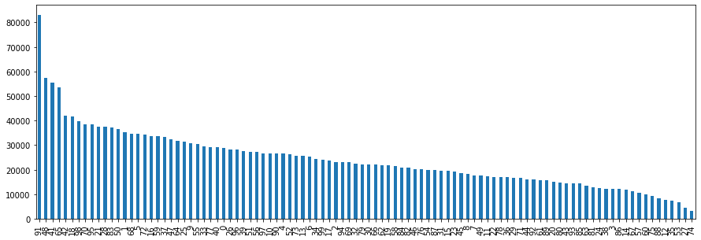
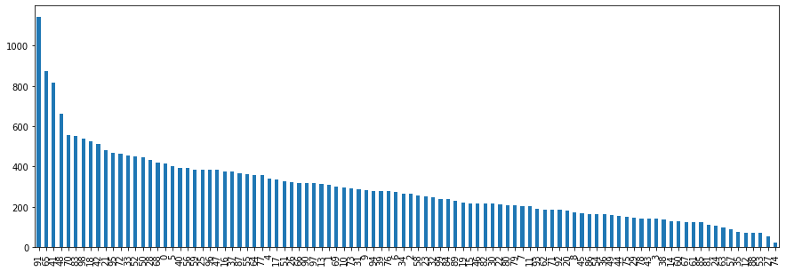
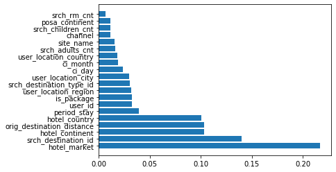

# Hotel Recommendations using Expedia public data


```python
import datetime
import pandas as pd
import numpy as np
import matplotlib.pyplot as plt
import seaborn as sns
import ml_metrics as metrics
%matplotlib inline
from sklearn.model_selection import GridSearchCV
from sklearn.ensemble import RandomForestClassifier
from sklearn.model_selection import train_test_split
from sklearn.metrics import classification_report
from sklearn.metrics import confusion_matrix  
from sklearn.metrics import accuracy_score
```


```python
df = pd.read_csv('train.csv', sep=',').dropna()

```


```python
df1 = pd.read_csv('train.csv', sep=',').dropna()
```


```python
#try with 10% of data first
train = df.sample(frac=0.1, random_state=99)
test = df1.sample(frac=0.1, random_state=99)
```

## Data exploration


```python
print(train.shape)
train.head()
```

    (2411789, 24)
    


<div>
<style scoped>
    .dataframe tbody tr th:only-of-type {
        vertical-align: middle;
    }

    .dataframe tbody tr th {
        vertical-align: top;
    }

    .dataframe thead th {
        text-align: right;
    }
</style>
<table border="1" class="dataframe">
  <thead>
    <tr style="text-align: right;">
      <th></th>
      <th>date_time</th>
      <th>site_name</th>
      <th>posa_continent</th>
      <th>user_location_country</th>
      <th>user_location_region</th>
      <th>user_location_city</th>
      <th>orig_destination_distance</th>
      <th>user_id</th>
      <th>is_mobile</th>
      <th>is_package</th>
      <th>...</th>
      <th>srch_children_cnt</th>
      <th>srch_rm_cnt</th>
      <th>srch_destination_id</th>
      <th>srch_destination_type_id</th>
      <th>is_booking</th>
      <th>cnt</th>
      <th>hotel_continent</th>
      <th>hotel_country</th>
      <th>hotel_market</th>
      <th>hotel_cluster</th>
    </tr>
  </thead>
  <tbody>
    <tr>
      <th>32352134</th>
      <td>2014-05-22 11:40:07</td>
      <td>2</td>
      <td>3</td>
      <td>66</td>
      <td>174</td>
      <td>24103</td>
      <td>2323.5232</td>
      <td>802499</td>
      <td>0</td>
      <td>1</td>
      <td>...</td>
      <td>0</td>
      <td>1</td>
      <td>1442</td>
      <td>3</td>
      <td>0</td>
      <td>1</td>
      <td>4</td>
      <td>125</td>
      <td>177</td>
      <td>44</td>
    </tr>
    <tr>
      <th>29796021</th>
      <td>2013-06-29 12:24:37</td>
      <td>2</td>
      <td>3</td>
      <td>66</td>
      <td>311</td>
      <td>25538</td>
      <td>2288.6121</td>
      <td>85229</td>
      <td>0</td>
      <td>0</td>
      <td>...</td>
      <td>1</td>
      <td>1</td>
      <td>8272</td>
      <td>1</td>
      <td>0</td>
      <td>1</td>
      <td>2</td>
      <td>50</td>
      <td>659</td>
      <td>59</td>
    </tr>
    <tr>
      <th>15185156</th>
      <td>2014-10-30 13:58:32</td>
      <td>2</td>
      <td>3</td>
      <td>66</td>
      <td>294</td>
      <td>40046</td>
      <td>587.6970</td>
      <td>755217</td>
      <td>0</td>
      <td>1</td>
      <td>...</td>
      <td>0</td>
      <td>1</td>
      <td>11321</td>
      <td>1</td>
      <td>0</td>
      <td>1</td>
      <td>2</td>
      <td>50</td>
      <td>642</td>
      <td>22</td>
    </tr>
    <tr>
      <th>3301948</th>
      <td>2014-08-22 20:14:34</td>
      <td>2</td>
      <td>3</td>
      <td>66</td>
      <td>332</td>
      <td>55121</td>
      <td>2234.4394</td>
      <td>160733</td>
      <td>0</td>
      <td>1</td>
      <td>...</td>
      <td>0</td>
      <td>1</td>
      <td>1152</td>
      <td>1</td>
      <td>1</td>
      <td>1</td>
      <td>4</td>
      <td>47</td>
      <td>1502</td>
      <td>65</td>
    </tr>
    <tr>
      <th>25429119</th>
      <td>2014-03-25 18:47:43</td>
      <td>2</td>
      <td>3</td>
      <td>66</td>
      <td>314</td>
      <td>47869</td>
      <td>839.0087</td>
      <td>1078493</td>
      <td>0</td>
      <td>0</td>
      <td>...</td>
      <td>0</td>
      <td>1</td>
      <td>8284</td>
      <td>1</td>
      <td>0</td>
      <td>4</td>
      <td>2</td>
      <td>50</td>
      <td>685</td>
      <td>6</td>
    </tr>
  </tbody>
</table>
<p>5 rows × 24 columns</p>
</div>


```python
Description = pd.DataFrame(['Timestamp',
                           'ID of the Expedia point of sale (Expedia.com)',
                           'ID of continent with site_name',
                           'The ID of the country the customer is located',
                           'The ID of the region the customer is located',
                           'The ID of the city the customer is located',
                           'distance between hotel and customer time of search',
                           'ID of user',
                           '1 from a mobile device, 0 otherwise',
                           '1 click/booking combined with a flight, 0 otherwise',
                           'ID of a marketing channel',
                           'Checkin date',
                           'Checkout date',
                           'The number of adults specified in the hotel room',
                           'The number of children specified in the hotel room',
                           'The number of hotel rooms specified in the search',
                           'ID of the destination hotel search was performed',
                           'Type of destination',
                           '1 if a booking, 0 if a click',
                           'Numer of similar events same user session',
                           'Hotel continent',
                           'Hotel country',
                           'Hotel market',
                           'ID of a hotel cluster',])
DataType = pd.DataFrame(['string','int','int','int','int','int','double','int','tinyint','int','int','string','string','int','int','int','int','int','tinyint','bigint','int','int','int','int'])
test3 = pd.concat([pd.Series(train.columns),Description,DataType], axis=1)
test3.columns = ['Variables','Description','DataType']
tmp2 =test3.set_index('Variables')
tmp2
```


<div>
<style scoped>
    .dataframe tbody tr th:only-of-type {
        vertical-align: middle;
    }

    .dataframe tbody tr th {
        vertical-align: top;
    }

    .dataframe thead th {
        text-align: right;
    }
</style>
<table border="1" class="dataframe">
  <thead>
    <tr style="text-align: right;">
      <th></th>
      <th>Description</th>
      <th>DataType</th>
    </tr>
    <tr>
      <th>Variables</th>
      <th></th>
      <th></th>
    </tr>
  </thead>
  <tbody>
    <tr>
      <th>date_time</th>
      <td>Timestamp</td>
      <td>string</td>
    </tr>
    <tr>
      <th>site_name</th>
      <td>ID of the Expedia point of sale (Expedia.com)</td>
      <td>int</td>
    </tr>
    <tr>
      <th>posa_continent</th>
      <td>ID of continent with site_name</td>
      <td>int</td>
    </tr>
    <tr>
      <th>user_location_country</th>
      <td>The ID of the country the customer is located</td>
      <td>int</td>
    </tr>
    <tr>
      <th>user_location_region</th>
      <td>The ID of the region the customer is located</td>
      <td>int</td>
    </tr>
    <tr>
      <th>user_location_city</th>
      <td>The ID of the city the customer is located</td>
      <td>int</td>
    </tr>
    <tr>
      <th>orig_destination_distance</th>
      <td>distance between hotel and customer time of se...</td>
      <td>double</td>
    </tr>
    <tr>
      <th>user_id</th>
      <td>ID of user</td>
      <td>int</td>
    </tr>
    <tr>
      <th>is_mobile</th>
      <td>1 from a mobile device, 0 otherwise</td>
      <td>tinyint</td>
    </tr>
    <tr>
      <th>is_package</th>
      <td>1 click/booking combined with a flight, 0 othe...</td>
      <td>int</td>
    </tr>
    <tr>
      <th>channel</th>
      <td>ID of a marketing channel</td>
      <td>int</td>
    </tr>
    <tr>
      <th>srch_ci</th>
      <td>Checkin date</td>
      <td>string</td>
    </tr>
    <tr>
      <th>srch_co</th>
      <td>Checkout date</td>
      <td>string</td>
    </tr>
    <tr>
      <th>srch_adults_cnt</th>
      <td>The number of adults specified in the hotel room</td>
      <td>int</td>
    </tr>
    <tr>
      <th>srch_children_cnt</th>
      <td>The number of children specified in the hotel ...</td>
      <td>int</td>
    </tr>
    <tr>
      <th>srch_rm_cnt</th>
      <td>The number of hotel rooms specified in the search</td>
      <td>int</td>
    </tr>
    <tr>
      <th>srch_destination_id</th>
      <td>ID of the destination hotel search was performed</td>
      <td>int</td>
    </tr>
    <tr>
      <th>srch_destination_type_id</th>
      <td>Type of destination</td>
      <td>int</td>
    </tr>
    <tr>
      <th>is_booking</th>
      <td>1 if a booking, 0 if a click</td>
      <td>tinyint</td>
    </tr>
    <tr>
      <th>cnt</th>
      <td>Numer of similar events same user session</td>
      <td>bigint</td>
    </tr>
    <tr>
      <th>hotel_continent</th>
      <td>Hotel continent</td>
      <td>int</td>
    </tr>
    <tr>
      <th>hotel_country</th>
      <td>Hotel country</td>
      <td>int</td>
    </tr>
    <tr>
      <th>hotel_market</th>
      <td>Hotel market</td>
      <td>int</td>
    </tr>
    <tr>
      <th>hotel_cluster</th>
      <td>ID of a hotel cluster</td>
      <td>int</td>
    </tr>
  </tbody>
</table>
</div>


```python
# feature correlation
fig, ax = plt.subplots()
fig.set_size_inches(20, 15)
sns.heatmap(train.corr(),cmap='RdBu_r',ax=ax,annot=True,linewidths=2)
```


    <matplotlib.axes._subplots.AxesSubplot at 0x2c183a3b048>


```python
# Distribution of hotel cluster
train["hotel_cluster"].value_counts().plot(kind='bar',figsize=(15,5))
```


    <matplotlib.axes._subplots.AxesSubplot at 0x2be1f4b9f28>





```python
# Distribution of hotel cluster in most popylar region
print(train["user_location_region"].max) #popular region
tmp3 = train[train["user_location_region"] ==  314]
tmp3["hotel_cluster"].value_counts().plot(kind='bar',figsize=(15,5))
```

    <bound method Series.max of 32352134    174
    29796021    311
    15185156    294
    3301948     332
    25429119    314
               ... 
    37149201    986
    23702311    337
    34542691    174
    32394746    220
    27381639    346
    Name: user_location_region, Length: 2411789, dtype: int64>
    


    <matplotlib.axes._subplots.AxesSubplot at 0x2bf190390b8>





## Data Cleaning

### Date and time


```python
#Convert to date_time type
def extract(train):
    train['srch_ci'] = pd.to_datetime(train['srch_ci'])
    train['srch_co'] = pd.to_datetime(train['srch_co'])
    train['date_time'] = pd.to_datetime(train['date_time'])
extract(train)
extract(test)
train.info()
```

    <class 'pandas.core.frame.DataFrame'>
    Int64Index: 2411789 entries, 32352134 to 27381639
    Data columns (total 24 columns):
    date_time                    datetime64[ns]
    site_name                    int64
    posa_continent               int64
    user_location_country        int64
    user_location_region         int64
    user_location_city           int64
    orig_destination_distance    float64
    user_id                      int64
    is_mobile                    int64
    is_package                   int64
    channel                      int64
    srch_ci                      datetime64[ns]
    srch_co                      datetime64[ns]
    srch_adults_cnt              int64
    srch_children_cnt            int64
    srch_rm_cnt                  int64
    srch_destination_id          int64
    srch_destination_type_id     int64
    is_booking                   int64
    cnt                          int64
    hotel_continent              int64
    hotel_country                int64
    hotel_market                 int64
    hotel_cluster                int64
    dtypes: datetime64[ns](3), float64(1), int64(20)
    memory usage: 460.0 MB
    


```python
# create a new feature (period_stay)
train['period_stay'] = (train['srch_co'] - train['srch_ci']).astype('timedelta64[D]')
```


```python
# extract day, month, year  from check in data and check out date
def extractdmy(df) :
    df['ci_day'] = df['srch_ci'].apply(lambda x: x.day)
    df['ci_month'] = df['srch_ci'].apply(lambda x: x.month)
    df['ci_year'] = df['srch_ci'].apply(lambda x: x.year)
extractdmy(train)
extractdmy(test)
```


```python
#filter only booking
train_book = train[train['is_booking'] == 1]
```


```python
#drop irrelevant columns
drop_columns = ['date_time', 'srch_ci', 'srch_co','is_booking']
train_book.drop(drop_columns,axis=1,inplace=True)
```

    C:\Users\PK\Anaconda3\lib\site-packages\pandas\core\frame.py:4117: SettingWithCopyWarning: 
    A value is trying to be set on a copy of a slice from a DataFrame
    
    See the caveats in the documentation: http://pandas.pydata.org/pandas-docs/stable/user_guide/indexing.html#returning-a-view-versus-a-copy
      errors=errors,
    


```python
train_book.head()
```


<div>
<style scoped>
    .dataframe tbody tr th:only-of-type {
        vertical-align: middle;
    }

    .dataframe tbody tr th {
        vertical-align: top;
    }

    .dataframe thead th {
        text-align: right;
    }
</style>
<table border="1" class="dataframe">
  <thead>
    <tr style="text-align: right;">
      <th></th>
      <th>site_name</th>
      <th>posa_continent</th>
      <th>user_location_country</th>
      <th>user_location_region</th>
      <th>user_location_city</th>
      <th>orig_destination_distance</th>
      <th>user_id</th>
      <th>is_mobile</th>
      <th>is_package</th>
      <th>channel</th>
      <th>...</th>
      <th>srch_destination_type_id</th>
      <th>cnt</th>
      <th>hotel_continent</th>
      <th>hotel_country</th>
      <th>hotel_market</th>
      <th>hotel_cluster</th>
      <th>period_stay</th>
      <th>ci_day</th>
      <th>ci_month</th>
      <th>ci_year</th>
    </tr>
  </thead>
  <tbody>
    <tr>
      <th>3301948</th>
      <td>2</td>
      <td>3</td>
      <td>66</td>
      <td>332</td>
      <td>55121</td>
      <td>2234.4394</td>
      <td>160733</td>
      <td>0</td>
      <td>1</td>
      <td>9</td>
      <td>...</td>
      <td>1</td>
      <td>1</td>
      <td>4</td>
      <td>47</td>
      <td>1502</td>
      <td>65</td>
      <td>7.0</td>
      <td>23</td>
      <td>1</td>
      <td>2015</td>
    </tr>
    <tr>
      <th>7791597</th>
      <td>34</td>
      <td>3</td>
      <td>205</td>
      <td>135</td>
      <td>27655</td>
      <td>234.6637</td>
      <td>1194667</td>
      <td>0</td>
      <td>0</td>
      <td>5</td>
      <td>...</td>
      <td>6</td>
      <td>1</td>
      <td>2</td>
      <td>198</td>
      <td>1625</td>
      <td>63</td>
      <td>1.0</td>
      <td>1</td>
      <td>1</td>
      <td>2014</td>
    </tr>
    <tr>
      <th>15784165</th>
      <td>13</td>
      <td>1</td>
      <td>46</td>
      <td>157</td>
      <td>34868</td>
      <td>612.4875</td>
      <td>1160376</td>
      <td>0</td>
      <td>0</td>
      <td>9</td>
      <td>...</td>
      <td>1</td>
      <td>1</td>
      <td>6</td>
      <td>105</td>
      <td>12</td>
      <td>8</td>
      <td>3.0</td>
      <td>20</td>
      <td>6</td>
      <td>2014</td>
    </tr>
    <tr>
      <th>1895669</th>
      <td>2</td>
      <td>3</td>
      <td>66</td>
      <td>337</td>
      <td>6988</td>
      <td>943.0843</td>
      <td>1134956</td>
      <td>0</td>
      <td>0</td>
      <td>2</td>
      <td>...</td>
      <td>5</td>
      <td>1</td>
      <td>2</td>
      <td>50</td>
      <td>682</td>
      <td>71</td>
      <td>1.0</td>
      <td>20</td>
      <td>3</td>
      <td>2013</td>
    </tr>
    <tr>
      <th>20823467</th>
      <td>13</td>
      <td>1</td>
      <td>46</td>
      <td>347</td>
      <td>38786</td>
      <td>611.3314</td>
      <td>241627</td>
      <td>0</td>
      <td>0</td>
      <td>9</td>
      <td>...</td>
      <td>1</td>
      <td>1</td>
      <td>6</td>
      <td>15</td>
      <td>38</td>
      <td>85</td>
      <td>1.0</td>
      <td>27</td>
      <td>5</td>
      <td>2015</td>
    </tr>
  </tbody>
</table>
<p>5 rows × 24 columns</p>
</div>


## Feature Engineering


```python
# define features and outcome for cross validation
y=train_book['hotel_cluster']
x=train_book.drop(['hotel_cluster','ci_year'],axis=1)
print(x.shape,y.shape)
```


```python
# Rank improtance measure of features using RandomForest
X_train, X_test, y_train, y_test = train_test_split(x,y, test_size=0.33)
rf_tree = RandomForestClassifier(n_estimators=31,max_depth=10,random_state=123)
rf_tree.fit(X_train,y_train)
```


    RandomForestClassifier(bootstrap=True, class_weight=None, criterion='gini',
                           max_depth=10, max_features='auto', max_leaf_nodes=None,
                           min_impurity_decrease=0.0, min_impurity_split=None,
                           min_samples_leaf=1, min_samples_split=2,
                           min_weight_fraction_leaf=0.0, n_estimators=31,
                           n_jobs=None, oob_score=False, random_state=123,
                           verbose=0, warm_start=False)


```python
# Plot feature importances
importances = rf_tree.feature_importances_
indices=np.argsort(importances)[::-1][:20]
plt.barh(range(20), importances[indices])
plt.yticks(range(20),X_train.columns[indices])
plt.show()
```





```python
RIM = pd.DataFrame([np.cumsum(importances[indices]),importances[indices]])
RIM.columns = [X_train.columns[indices]]
RIM # 6 features explain 0.7 of importances
```


<div>
<style scoped>
    .dataframe tbody tr th:only-of-type {
        vertical-align: middle;
    }

    .dataframe tbody tr th {
        vertical-align: top;
    }

    .dataframe thead tr th {
        text-align: left;
    }
</style>
<table border="1" class="dataframe">
  <thead>
    <tr>
      <th></th>
      <th>hotel_market</th>
      <th>srch_destination_id</th>
      <th>hotel_continent</th>
      <th>orig_destination_distance</th>
      <th>hotel_country</th>
      <th>period_stay</th>
      <th>user_id</th>
      <th>is_package</th>
      <th>user_location_region</th>
      <th>srch_destination_type_id</th>
      <th>user_location_city</th>
      <th>ci_day</th>
      <th>ci_month</th>
      <th>user_location_country</th>
      <th>srch_adults_cnt</th>
      <th>site_name</th>
      <th>channel</th>
      <th>srch_children_cnt</th>
      <th>posa_continent</th>
      <th>srch_rm_cnt</th>
    </tr>
  </thead>
  <tbody>
    <tr>
      <th>0</th>
      <td>0.216915</td>
      <td>0.356841</td>
      <td>0.460355</td>
      <td>0.563607</td>
      <td>0.664299</td>
      <td>0.703782</td>
      <td>0.736183</td>
      <td>0.768546</td>
      <td>0.800105</td>
      <td>0.830723</td>
      <td>0.860256</td>
      <td>0.884104</td>
      <td>0.903031</td>
      <td>0.921017</td>
      <td>0.937464</td>
      <td>0.953035</td>
      <td>0.964655</td>
      <td>0.976061</td>
      <td>0.987250</td>
      <td>0.993921</td>
    </tr>
    <tr>
      <th>1</th>
      <td>0.216915</td>
      <td>0.139927</td>
      <td>0.103514</td>
      <td>0.103252</td>
      <td>0.100692</td>
      <td>0.039483</td>
      <td>0.032402</td>
      <td>0.032363</td>
      <td>0.031559</td>
      <td>0.030617</td>
      <td>0.029533</td>
      <td>0.023848</td>
      <td>0.018926</td>
      <td>0.017987</td>
      <td>0.016446</td>
      <td>0.015572</td>
      <td>0.011620</td>
      <td>0.011406</td>
      <td>0.011189</td>
      <td>0.006671</td>
    </tr>
  </tbody>
</table>
</div>


## Models

### Model Selection


```python
df.corr()["hotel_cluster"].sort_values() # no correlation with with outcome suggesting non-linear model
```


    srch_destination_type_id    -0.037433
    site_name                   -0.025984
    is_booking                  -0.024721
    hotel_country               -0.024228
    user_location_country       -0.019055
    srch_destination_id         -0.015235
    srch_rm_cnt                 -0.005542
    user_location_city          -0.001593
    channel                     -0.000730
    hotel_continent              0.001206
    user_id                      0.001472
    cnt                          0.002748
    is_mobile                    0.006939
    orig_destination_distance    0.007250
    user_location_region         0.009046
    srch_adults_cnt              0.010086
    posa_continent               0.012346
    srch_children_cnt            0.014271
    hotel_market                 0.023382
    is_package                   0.048056
    hotel_cluster                1.000000
    Name: hotel_cluster, dtype: float64


### Baseline model


```python
# start with baseline model
# 1. Using the most popular hotel cluster(pop_hotel) as a predictors
pop_hotel = list(train['hotel_cluster'].value_counts().head().index)
predictions = [pop_hotel for i in range(test.shape[0])]
print('Mean Average Precision =',metrics.mapk([[l] for l in test['hotel_cluster']], predictions, k=5))
```

    Mean Average Precision = 0.0629900597993163
    
