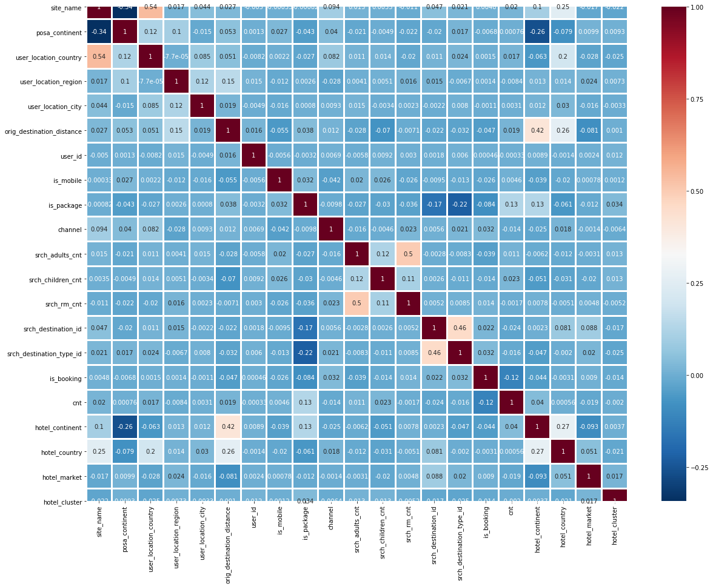

# Hotel Recommendations using Expedia public data


```python
import datetime
import pandas as pd
import numpy as np
import matplotlib.pyplot as plt
import seaborn as sns
%matplotlib inline
from sklearn.ensemble import RandomForestClassifier
from sklearn.neighbors import KNeighborsClassifier
from sklearn.svm import SVC, LinearSVC
from sklearn.model_selection import train_test_split
from sklearn.preprocessing import StandardScaler
from sklearn.decomposition import PCA
from sklearn.metrics import classification_report
from sklearn.metrics import confusion_matrix  
from sklearn.metrics import accuracy_score
```


```python
df = pd.read_csv('train.csv', sep=',').dropna()

```


```python
df1 = pd.read_csv('train.csv', sep=',').dropna()
```


```python
train = df.sample(frac=0.1, random_state=99)
test = df1.sample(frac=0.1, random_state=99)
```

## Data exploration


```python
print(train.shape)
train.head()
```

    (24118, 24)
    


<div>
<style scoped>
    .dataframe tbody tr th:only-of-type {
        vertical-align: middle;
    }

    .dataframe tbody tr th {
        vertical-align: top;
    }

    .dataframe thead th {
        text-align: right;
    }
</style>
<table border="1" class="dataframe">
  <thead>
    <tr style="text-align: right;">
      <th></th>
      <th>date_time</th>
      <th>site_name</th>
      <th>posa_continent</th>
      <th>user_location_country</th>
      <th>user_location_region</th>
      <th>user_location_city</th>
      <th>orig_destination_distance</th>
      <th>user_id</th>
      <th>is_mobile</th>
      <th>is_package</th>
      <th>...</th>
      <th>srch_children_cnt</th>
      <th>srch_rm_cnt</th>
      <th>srch_destination_id</th>
      <th>srch_destination_type_id</th>
      <th>is_booking</th>
      <th>cnt</th>
      <th>hotel_continent</th>
      <th>hotel_country</th>
      <th>hotel_market</th>
      <th>hotel_cluster</th>
    </tr>
  </thead>
  <tbody>
    <tr>
      <th>548833</th>
      <td>2014-01-02 13:21:24</td>
      <td>2</td>
      <td>3</td>
      <td>66</td>
      <td>314</td>
      <td>4868</td>
      <td>664.4725</td>
      <td>666655</td>
      <td>0</td>
      <td>0</td>
      <td>...</td>
      <td>0</td>
      <td>1</td>
      <td>12009</td>
      <td>1</td>
      <td>0</td>
      <td>1</td>
      <td>2</td>
      <td>50</td>
      <td>680</td>
      <td>16</td>
    </tr>
    <tr>
      <th>18543555</th>
      <td>2014-04-07 20:04:52</td>
      <td>2</td>
      <td>3</td>
      <td>66</td>
      <td>348</td>
      <td>48862</td>
      <td>877.2622</td>
      <td>1059884</td>
      <td>0</td>
      <td>0</td>
      <td>...</td>
      <td>0</td>
      <td>1</td>
      <td>8283</td>
      <td>1</td>
      <td>0</td>
      <td>1</td>
      <td>2</td>
      <td>50</td>
      <td>414</td>
      <td>37</td>
    </tr>
    <tr>
      <th>9329359</th>
      <td>2014-10-07 21:06:16</td>
      <td>2</td>
      <td>3</td>
      <td>66</td>
      <td>348</td>
      <td>48862</td>
      <td>478.0449</td>
      <td>85192</td>
      <td>0</td>
      <td>0</td>
      <td>...</td>
      <td>0</td>
      <td>1</td>
      <td>8233</td>
      <td>1</td>
      <td>0</td>
      <td>1</td>
      <td>2</td>
      <td>50</td>
      <td>640</td>
      <td>13</td>
    </tr>
    <tr>
      <th>24053860</th>
      <td>2013-06-25 07:03:33</td>
      <td>2</td>
      <td>3</td>
      <td>66</td>
      <td>348</td>
      <td>48862</td>
      <td>1570.7304</td>
      <td>1032027</td>
      <td>0</td>
      <td>1</td>
      <td>...</td>
      <td>0</td>
      <td>1</td>
      <td>1152</td>
      <td>1</td>
      <td>0</td>
      <td>1</td>
      <td>4</td>
      <td>47</td>
      <td>1502</td>
      <td>65</td>
    </tr>
    <tr>
      <th>27121155</th>
      <td>2013-10-09 08:53:20</td>
      <td>2</td>
      <td>3</td>
      <td>66</td>
      <td>220</td>
      <td>5420</td>
      <td>2.3135</td>
      <td>204685</td>
      <td>0</td>
      <td>0</td>
      <td>...</td>
      <td>0</td>
      <td>1</td>
      <td>28568</td>
      <td>6</td>
      <td>0</td>
      <td>1</td>
      <td>2</td>
      <td>50</td>
      <td>593</td>
      <td>28</td>
    </tr>
  </tbody>
</table>
<p>5 rows × 24 columns</p>
</div>


```python
Description = pd.DataFrame(['Timestamp',
                           'ID of the Expedia point of sale (Expedia.com)',
                           'ID of continent with site_name',
                           'The ID of the country the customer is located',
                           'The ID of the region the customer is located',
                           'The ID of the city the customer is located',
                           'distance between hotel and customer time of search',
                           'ID of user',
                           '1 from a mobile device, 0 otherwise',
                           '1 click/booking combined with a flight, 0 otherwise',
                           'ID of a marketing channel',
                           'Checkin date',
                           'Checkout date',
                           'The number of adults specified in the hotel room',
                           'The number of children specified in the hotel room',
                           'The number of hotel rooms specified in the search',
                           'ID of the destination hotel search was performed',
                           'Type of destination',
                           '1 if a booking, 0 if a click',
                           'Numer of similar events same user session',
                           'Hotel continent',
                           'Hotel country',
                           'Hotel market',
                           'ID of a hotel cluster',])
DataType = pd.DataFrame(['string','int','int','int','int','int','double','int','tinyint','int','int','string','string','int','int','int','int','int','tinyint','bigint','int','int','int','int'])
test3 = pd.concat([pd.Series(train.columns),Description,DataType], axis=1)
test3.columns = ['Variables','Description','DataType']
test3.set_index('Variables')
```


<div>
<style scoped>
    .dataframe tbody tr th:only-of-type {
        vertical-align: middle;
    }

    .dataframe tbody tr th {
        vertical-align: top;
    }

    .dataframe thead th {
        text-align: right;
    }
</style>
<table border="1" class="dataframe">
  <thead>
    <tr style="text-align: right;">
      <th></th>
      <th>Description</th>
      <th>DataType</th>
    </tr>
    <tr>
      <th>Variables</th>
      <th></th>
      <th></th>
    </tr>
  </thead>
  <tbody>
    <tr>
      <th>date_time</th>
      <td>Timestamp</td>
      <td>string</td>
    </tr>
    <tr>
      <th>site_name</th>
      <td>ID of the Expedia point of sale (Expedia.com)</td>
      <td>int</td>
    </tr>
    <tr>
      <th>posa_continent</th>
      <td>ID of continent with site_name</td>
      <td>int</td>
    </tr>
    <tr>
      <th>user_location_country</th>
      <td>The ID of the country the customer is located</td>
      <td>int</td>
    </tr>
    <tr>
      <th>user_location_region</th>
      <td>The ID of the region the customer is located</td>
      <td>int</td>
    </tr>
    <tr>
      <th>user_location_city</th>
      <td>The ID of the city the customer is located</td>
      <td>int</td>
    </tr>
    <tr>
      <th>orig_destination_distance</th>
      <td>distance between hotel and customer time of se...</td>
      <td>double</td>
    </tr>
    <tr>
      <th>user_id</th>
      <td>ID of user</td>
      <td>int</td>
    </tr>
    <tr>
      <th>is_mobile</th>
      <td>1 from a mobile device, 0 otherwise</td>
      <td>tinyint</td>
    </tr>
    <tr>
      <th>is_package</th>
      <td>1 click/booking combined with a flight, 0 othe...</td>
      <td>int</td>
    </tr>
    <tr>
      <th>channel</th>
      <td>ID of a marketing channel</td>
      <td>int</td>
    </tr>
    <tr>
      <th>srch_ci</th>
      <td>Checkin date</td>
      <td>string</td>
    </tr>
    <tr>
      <th>srch_co</th>
      <td>Checkout date</td>
      <td>string</td>
    </tr>
    <tr>
      <th>srch_adults_cnt</th>
      <td>The number of adults specified in the hotel room</td>
      <td>int</td>
    </tr>
    <tr>
      <th>srch_children_cnt</th>
      <td>The number of children specified in the hotel ...</td>
      <td>int</td>
    </tr>
    <tr>
      <th>srch_rm_cnt</th>
      <td>The number of hotel rooms specified in the search</td>
      <td>int</td>
    </tr>
    <tr>
      <th>srch_destination_id</th>
      <td>ID of the destination hotel search was performed</td>
      <td>int</td>
    </tr>
    <tr>
      <th>srch_destination_type_id</th>
      <td>Type of destination</td>
      <td>int</td>
    </tr>
    <tr>
      <th>is_booking</th>
      <td>1 if a booking, 0 if a click</td>
      <td>tinyint</td>
    </tr>
    <tr>
      <th>cnt</th>
      <td>Numer of similar events same user session</td>
      <td>bigint</td>
    </tr>
    <tr>
      <th>hotel_continent</th>
      <td>Hotel continent</td>
      <td>int</td>
    </tr>
    <tr>
      <th>hotel_country</th>
      <td>Hotel country</td>
      <td>int</td>
    </tr>
    <tr>
      <th>hotel_market</th>
      <td>Hotel market</td>
      <td>int</td>
    </tr>
    <tr>
      <th>hotel_cluster</th>
      <td>ID of a hotel cluster</td>
      <td>int</td>
    </tr>
  </tbody>
</table>
</div>


```python
# feature correlation
fig, ax = plt.subplots()
fig.set_size_inches(20, 15)
sns.heatmap(train.corr(),cmap='RdBu_r',ax=ax,annot=True,linewidths=2)
```


    <matplotlib.axes._subplots.AxesSubplot at 0x21c10a1af28>





## Data Cleaning


```python
#Clean dates

```
